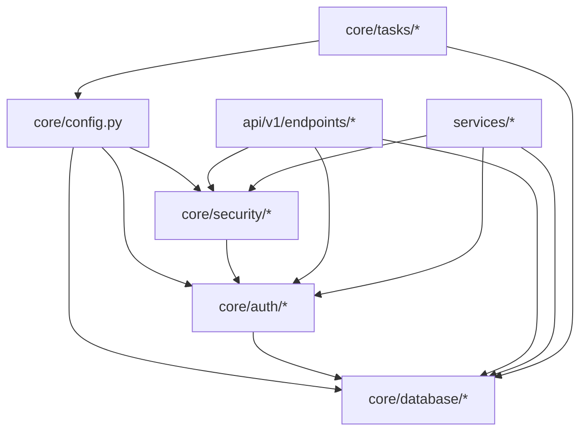

# AUL Quote App Architecture

## Overview

The AUL Quote App is built using FastAPI and React, following a modern, scalable architecture with AI integration. This document outlines the architectural decisions, patterns, and best practices used in the project.

## Documentation Organization

This document serves as the authoritative source for system design and dependencies. Other documentation is organized as follows:

### Core Documentation
1. [README.md](../README.md) - Main entry point and project overview
2. [MIGRATION.md](./MIGRATION.md) - Current progress and next steps
3. [ARCHITECTURE.md](./ARCHITECTURE.md) - This file, system design and dependencies

### Component Documentation
Each major component has its own README.md that details implementation specifics:
1. Backend ([warehouse_quote_app/README.md](../warehouse_quote_app/README.md))
   - Service implementation details
   - API documentation
   - Database schemas
   - Business logic

2. Frontend ([frontend/README.md](../frontend/README.md))
   - Component structure
   - State management
   - API integration
   - UI/UX patterns

3. Configuration ([deployment/config/README.md](../deployment/config/README.md))
   - Environment setup
   - Configuration options
   - Security settings
   - Deployment variables

4. Scripts ([deployment/scripts/README.md](../deployment/scripts/README.md))
   - Utility scripts
   - Deployment automation
   - Database management
   - Testing tools

5. Shared Utilities ([shared/README.md](../shared/README.md))
   - Common functions
   - Shared types
   - Helper utilities
   - Integration points

## Component Dependencies

### Core Dependencies
1. Configuration → Security → API
   - Configuration must be loaded before security initialization
   - Security must be active before API endpoints
   - Environment settings affect both security and API behavior

2. Database → Services → Features
   - Database connection required for all services
   - Services depend on database models and repositories
   - Features require both database and services

3. AI/LLM → Rate Optimization → Quotes
   - AI models must be configured and loaded
   - Rate optimization depends on AI services
   - Quote generation needs both rate optimization and AI

### Service Dependencies
1. Authentication Service
   - Depends on: Database, Security, Configuration
   - Required by: All authenticated endpoints
   - Affects: User sessions, API access

2. Quote Service
   - Depends on: Database, AI/LLM, Rate Service
   - Required by: Quote generation, pricing
   - Affects: Customer quotes, pricing

3. Rate Service
   - Depends on: Database, AI/LLM
   - Required by: Quote Service, Admin Service
   - Affects: Pricing, optimization

4. Admin Service
   - Depends on: All other services
   - Required by: System management
   - Affects: Configuration, monitoring

### Frontend Dependencies
1. React Components
   - Depend on: API endpoints, WebSocket
   - Required by: User interface
   - Affect: User experience

2. State Management
   - Depends on: Authentication, WebSocket
   - Required by: All components
   - Affects: Data consistency

### Infrastructure Dependencies
1. Database (PostgreSQL)
   - Required by: All services
   - Affects: Data persistence, performance

2. Cache (Redis)
   - Required by: Rate limiting, sessions
   - Affects: Performance, scalability

3. AI/LLM Services
   - Required by: Quote, Rate services
   - Affects: Optimization, accuracy

## System Architecture

### Backend (FastAPI)

#### API Layer
```
api/
├── __init__.py
├── deps.py
└── v1/
    ├── __init__.py
    ├── chat.py
    ├── endpoints/
    │   ├── admin.py      # Admin management
    │   ├── auth.py       # Authentication
    │   ├── client.py     # Client operations
    │   ├── customer.py   # Customer management
    │   ├── quotes.py     # Quote operations
    │   └── rate_cards.py # Rate and optimization management
    └── ws.py            # WebSocket handling
```

#### Schema Layer
```
schemas/
├── __init__.py
├── admin.py          # Admin-related schemas
├── base.py          # Base schema models
├── conversation/    # Chat and conversation schemas
│   └── __init__.py
├── quote/          # Quote-related schemas
│   └── __init__.py
├── rate/           # Rate and optimization schemas
│   ├── rate.py
│   ├── rate_card.py
│   └── rate_optimization.py
├── reports/        # Reporting schemas
│   ├── __init__.py
│   ├── quote_report.py
│   ├── service_report.py
│   └── customer_report.py
└── user/           # User and authentication schemas
    ├── __init__.py
    ├── auth.py
    ├── customer.py
    └── user.py
```

#### Application Layer
```
warehouse_quote_app/
├── app/
│   ├── core/            # Core functionality
│   ├── database/        # Database configuration
│   ├── models/          # Database models
│   ├── repositories/    # Data access layer
│   ├── services/        # Business logic
│   ├── tasks/           # Background tasks
│   └── utils/           # Utility functions
├── config/            # Configuration files
│   ├── development/
│   ├── production/
│   └── test/
├── logs/               # Application logs
├── scripts/            # Utility scripts
└── tests/            # Test suites
    ├── api/
    ├── integration/
    └── unit/
```

### Frontend (React)

```
frontend/
├── src/
│   ├── components/
│   │   ├── admin/
│   │   ├── auth/
│   │   ├── client/
│   │   ├── common/
│   │   ├── forms/
│   │   ├── layout/
│   │   └── navigation/
│   ├── hooks/
│   ├── pages/
│   ├── services/
│   └── utils/
│       ├── errorHandler.ts
│       └── validation.ts
└── public/
```

## Project Structure

```
warehouse_quote_app/           # Main backend application
├── app/
│   ├── api/                  # API endpoints
│   ├── core/                # Core functionality
│   ├── models/              # Database models
│   ├── repositories/        # Data access layer
│   ├── schemas/            # Data validation schemas
│   └── services/           # Business logic
│       ├── business/       # Core business services
│       │   ├── quotes.py
│       │   └── rates.py
│       ├── communication/  # Communication services
│       │   ├── email.py
│       │   └── ws.py
│       ├── llm/           # AI/ML services
│       │   ├── model.py
│       │   ├── rag.py
│       │   └── rate_integration.py
│       └── validation/    # Validation services
│           └── validation.py
├── config/                # Configuration files
│   ├── development/
│   ├── production/
│   └── test/
└── tests/                # Test suites
    ├── api/
    ├── integration/
    └── unit/

frontend/                 # React frontend application
├── src/
│   ├── components/
│   ├── hooks/
│   ├── pages/
│   ├── services/
│   └── utils/
└── public/

deployment/              # Deployment configuration
├── docker/             # Docker configuration
│   ├── backend/
│   └── frontend/
└── scripts/            # Deployment scripts
    ├── backend/
    └── frontend/

docs/                   # Documentation
├── API.md
├── ARCHITECTURE.md
├── DEPLOYMENT.md
└── TESTING.md
```

## Core Architecture

### Core Module Structure
```
core/
├── __init__.py
├── admin/           # Admin-specific core functionality
├── auth/           # Authentication and authorization
│   ├── __init__.py
│   ├── dependencies.py  # FastAPI auth dependencies
│   ├── jwt.py          # JWT token handling
│   └── service.py      # Auth service implementation
├── config.py       # Application configuration
├── database/       # Database handling
├── monitoring/     # System monitoring
├── security/       # Security utilities
│   ├── __init__.py
│   ├── rate_limit.py   # Rate limiting
│   └── security.py     # Security utilities
└── tasks/          # Background task handling
```

### Authentication and Authorization

1. JWT Token Handling (`core/auth/jwt.py`):
   - Token generation and validation
   - Payload encoding/decoding
   - Expiration management
   - Refresh token handling

2. Auth Dependencies (`core/auth/dependencies.py`):
   - FastAPI dependency injection
   - User authentication flows
   - Permission checking
   - Session management

3. Auth Service (`core/auth/service.py`):
   - User authentication business logic
   - Password management
   - Session tracking
   - Audit logging

### Security Implementation

1. Core Security (`core/security/security.py`):
   - Password hashing
   - Token generation
   - API key validation
   - Security utilities

2. Rate Limiting (`core/security/rate_limit.py`):
   - Request rate limiting
   - Throttling configuration
   - Cache integration
   - IP tracking

### Configuration Management

The configuration system follows a hierarchical approach to manage settings across different environments and components.

#### Directory Structure
```
deployment/config/
├── .env            # Main environment file
├── .env.example    # Example configuration template
├── development/    # Development environment configs
│   ├── backend.env # Backend development settings
│   └── frontend.env# Frontend development settings
├── production/     # Production environment configs
├── staging/        # Staging environment configs
└── shared/        # Shared configuration
    ├── ai.env     # AI/LLM configuration
    ├── db.env     # Database configuration
    └── rag.env    # RAG system configuration
```

#### Configuration Architecture

1. Core Configuration:
   - Base settings in `.env`
   - Environment-specific overrides
   - Component-specific settings
   - Dependency management

2. Critical Dependencies:
   - Database → Connection Pool → Services
   - Security → Authentication → API Access
   - AI/LLM → Model → Quote Generation
   - Monitoring → Health → System Stability

3. Security:
   - Environment isolation
   - Secret management
   - Access control
   - Audit logging

4. Monitoring:
   - Configuration validation
   - Health checks
   - Performance metrics
   - Dependency tracking

For detailed migration steps and guidelines, refer to [MIGRATION.md](./MIGRATION.md).

### Database Management

1. Connection Handling:
   - Connection pool management
   - Session factories
   - Transaction handling
   - Migration support

2. Model Management:
   - Base model configuration
   - Relationship handling
   - Query optimization
   - Audit trails

### Security Guidelines

1. Authentication:
   - JWT-based authentication
   - Role-based access control (RBAC)
   - Session management
   - Password policies

2. API Security:
   - Rate limiting
   - Input validation
   - CORS configuration
   - API key management

3. Data Protection:
   - Password hashing with bcrypt
   - Secure token generation
   - Data encryption
   - Audit logging

### Development Guidelines

1. Core Module Development:
   - Keep modules focused and single-responsibility
   - Use dependency injection
   - Implement proper error handling
   - Add comprehensive logging

2. Security Development:
   - Follow security best practices
   - Regular security audits
   - Dependency scanning
   - Vulnerability checks

3. Configuration Management:
   - Use environment variables
   - Never commit secrets
   - Document all settings
   - Version control safely

### Testing Strategy

1. Unit Testing:
   - Test all core utilities
   - Mock external dependencies
   - Test security functions
   - Test configuration loading

2. Integration Testing:
   - Test authentication flows
   - Test database operations
   - Test rate limiting
   - Test configuration integration

3. Security Testing:
   - Test authentication bypass
   - Test authorization bypass
   - Test rate limit bypass
   - Test input validation

## Service Layer Organization

The service layer follows a domain-driven design with clear separation of concerns:

```
services/
├── business/           # Core business logic
│   ├── rates.py       # Rate management and optimization
│   ├── quotes.py      # Quote management
│   └── tasks/         # Business-specific background tasks
│       └── rates.py   # Rate-related tasks
├── communication/     # Communication services
│   ├── email.py      # Email notifications
│   └── ws.py         # WebSocket updates
├── llm/              # AI/ML services
│   ├── model.py      # LLM model configuration
│   ├── rag.py        # Retrieval-augmented generation
│   └── rate_integration.py  # Rate optimization with LLM
└── validation/       # Validation services
    └── validation.py # Business rule validation
```

### Business Services

The business layer contains core domain logic organized by feature:

1. Rate Management (`business/rates.py`):
   - CRUD operations for rates and rate cards
   - Rate validation and optimization
   - Integration with LLM for rate suggestions
   - Rate analytics and statistics
   - Background task coordination

2. Quote Management (`business/quotes.py`):
   - Quote creation and updates
   - Price calculations
   - Quote validation
   - Customer communication

3. Background Tasks (`business/tasks/`):
   - Rate card updates and optimization
   - Quote processing
   - Data cleanup and maintenance

### AI/ML Services

The LLM integration layer provides AI capabilities:

1. Core LLM (`llm/model.py`):
   - Model configuration
   - Prompt management
   - Response processing

2. RAG Service (`llm/rag.py`):
   - Document retrieval
   - Context management
   - Knowledge base integration

3. Rate Integration (`llm/rate_integration.py`):
   - Rate optimization suggestions
   - Market analysis
   - Validation rules
   - Historical data analysis

### Schema Organization

Schemas are organized by domain and type:

```
schemas/
├── rate/
│   ├── rate.py           # Basic rate schemas
│   ├── rate_card.py      # Rate card schemas
│   └── rate_optimization.py  # Optimization schemas
├── quote/
│   ├── quote.py          # Quote schemas
│   └── calculation.py    # Calculation schemas
└── user/
    └── user.py           # User schemas
```

### API Structure

The API follows RESTful conventions with versioning:

```
api/v1/
├── endpoints/
│   ├── rate_cards.py    # Rate management endpoints
│   ├── quotes.py        # Quote management endpoints
│   └── users.py         # User management endpoints
└── api.py               # API router configuration
```

Rate-related endpoints are consolidated under `/api/v1/rate-cards/`:

1. Rate Card Management:
   - POST `/rate-cards`: Create rate card
   - GET `/rate-cards`: List rate cards
   - GET `/rate-cards/{id}`: Get rate card
   - PUT `/rate-cards/{id}`: Update rate card

2. Rate Management:
   - POST `/rate-cards/rates`: Create rate
   - GET `/rate-cards/rates`: List rates
   - PUT `/rate-cards/rates/{id}`: Update rate
   - DELETE `/rate-cards/rates/{id}`: Delete rate

3. Rate Optimization:
   - POST `/rate-cards/{id}/optimize`: Optimize rate card
   - GET `/rate-cards/{id}/optimization-history`: Get optimization history
   - POST `/rate-cards/optimization/rules`: Create validation rule
   - GET `/rate-cards/optimization/rules`: List validation rules
   - POST `/rate-cards/optimization/market-analysis`: Create market analysis entry
   - GET `/rate-cards/optimization/market-analysis`: Get market analysis for service type
   - POST `/rate-cards/optimization/apply/{optimization_id}`: Apply an optimization

## Technology Stack

*   **Frontend:**
    *   React
    *   TypeScript
    *   Ant Design
    *   React Query
    *   React Router
*   **Backend:**
    *   FastAPI
    *   Python
    *   SQLAlchemy
    *   Pydantic
    *   Uvicorn
*   **Database:**
    *   PostgreSQL
*   **Cache:**
    *   Redis
*   **AI/ML:**
    *   Transformers
    *   Torch
    *   FAISS
    *   Sentence Transformers
    *   Langchain
*   **Monitoring:**
    *   Prometheus
    *   Grafana
*   **Other:**
    *   Docker
    *   Docker Compose
    *   Alembic

## Database Schema

### User Table

*   **Table:** `user`
    *   `id`: Integer, primary key.
    *   `email`: String(255), unique, indexed, not nullable.
    *   `username`: String(255), unique, indexed, not nullable.
    *   `hashed_password`: String(255), not nullable.
    *   `is_active`: Boolean, default True, not nullable.
    *   `is_admin`: Boolean, default False, not nullable.
    *   `first_name`: String(255), nullable.
    *   `last_name`: String(255), nullable.
    *   `phone`: String(50), nullable.
    *   `last_login`: DateTime, nullable.
    *   `password_changed_at`: DateTime, nullable.

### Customer Table

*   **Table:** `customer`
    *   `id`: Integer, primary key.
    *   `name`: String(100), not nullable.
    *   `email`: String(255), unique, indexed, not nullable.
    *   `phone`: String(20), not nullable.
    *   `address`: String(200), not nullable.
    *   `company_name`: String(100), nullable.
    *   `notes`: String(500), nullable.
    *   `is_active`: Boolean, default True, not nullable.
    *   `total_quotes`: Integer, default 0, not nullable.
    *   `accepted_quotes`: Integer, default 0, not nullable.
    *   `rejected_quotes`: Integer, default 0, not nullable.
    *   `total_spent`: Float, default 0.0, not nullable.
    *   `last_quote_date`: DateTime, nullable.
    *   `preferred_contact_method`: String(20), nullable.
    *   `notification_preferences`: String(100), nullable.
    *   `special_requirements`: String(500), nullable.

### Quote Table

*   **Table:** `quote`
    *   `id`: Integer, primary key.
    *   `customer_id`: Integer, ForeignKey("customer.id"), not nullable.
    *   `total_amount`: Numeric(10, 2), not nullable.
    *   `status`: String(50), not nullable, default "draft".
    *   `service_type`: String(50), not nullable.
    *   `storage_requirements`: JSON, nullable.
    *   `transport_services`: JSON, nullable.
    *   `special_requirements`: JSON, nullable.
    *   `submitted_at`: DateTime, nullable.
    *   `accepted_at`: DateTime, nullable.
    *   `rejected_at`: DateTime, nullable.
    *   `completed_at`: DateTime, nullable.
    *   `created_by`: Integer, ForeignKey("user.id"), not nullable.
    *   `accepted_by`: Integer, ForeignKey("user.id"), nullable.
    *   `rejected_by`: Integer, ForeignKey("user.id"), nullable.
    *   `completed_by`: Integer, ForeignKey("user.id"), nullable.

### Rate Table

*   **Table:** `rate`
    *   `id`: Integer, primary key.
    *   `name`: String(100), not nullable.
    *   `description`: String(500), not nullable.
    *   `base_rate`: Numeric(10, 2), not nullable.
    *   `service_type`: String(50), not nullable.
    *   `category`: String(50), not nullable.
    *   `valid_from`: DateTime, not nullable.
    *   `valid_until`: DateTime, not nullable.
    *   `is_active`: Boolean, not nullable, default True.
    *   `conditions`: JSON, nullable.
    *   `discounts`: JSON, nullable.
    *   `surcharges`: JSON, nullable.
    *   `optimization_history`: JSON, nullable, default list, comment "History of AI-powered rate optimizations".
    *   `market_analysis`: JSON, nullable, comment "Latest market analysis data".
    *   `confidence_score`: Numeric(5, 2), nullable, comment "AI confidence score for current rate".
    *   `last_optimized_at`: DateTime(timezone=True), nullable, onupdate func.now(), comment "Timestamp of last optimization".
    *   `optimization_metrics`: JSON, nullable, comment "Performance metrics from rate optimization".
    *   `validation_rules`: JSON, nullable, default list, comment "Custom validation rules for this rate".
    *   `parent_id`: Integer, ForeignKey("rate.id"), nullable.
    *   `version`: Integer, nullable, default 1.
    *   `created_by`: Integer, ForeignKey("user.id"), not nullable.
    *   `deactivated_by`: Integer, ForeignKey("user.id"), nullable.
    *   `deactivated_at`: DateTime, nullable.

## AI Integration Details

*   **AI Models:**
    *   WarehouseLLM: Used for quote generation and rate optimization.
*   **Integration Points:**
    *   Rate Optimization Service: Integrates LLMs with rate management.
    *   Chat Endpoints: Used to process chat messages for quote generation.
*   **Data Flow:**
    *   The Rate Integration Service interacts with the WarehouseLLM, RAGService, and CRUDRateCard to optimize rates.
    *   Chat messages are processed by the AI models to generate quotes and update existing quotes.

## Security Architecture

*   **Authentication:**
    *   JWT (JSON Web Tokens): Used for authentication and authorization.
    *   Custom `AuthContext` and `ProtectedRoute` components in the frontend.
*   **Authorization:**
    *   Role-based access control (RBAC): Implemented to restrict access to certain endpoints and resources based on user roles (e.g., admin, user).
*   **Data Protection:**
    *   HTTPS: Used to encrypt data in transit.
    *   Password hashing: Passwords are hashed using bcrypt before being stored in the database.
    *   Input validation: Implemented to prevent injection attacks.

## Scalability and Performance

*   **Load Balancing:**
    *   Implemented to distribute traffic across multiple instances of the backend.
*   **Caching:**
    *   Redis (optional): Can be used to cache frequently accessed data to reduce database load.
*   **Database Optimization:**
    *   Database indexes: Used to optimize query performance.
    *   Connection pooling: Used to reduce the overhead of establishing database connections.

## Data and Cache Architecture

*   **Database:**
    *   PostgreSQL: Stores persistent data, including user accounts, customer information, quotes, and rates.
    *   SQLAlchemy: ORM used to interact with the database.
*   **Caching:**
    *   Redis (optional): Can be used to cache frequently accessed data, such as rate calculations and user sessions, to improve performance.

## Shared Services

*   **Purpose:** Contains code shared between the frontend and backend.
*   **Key Directories:**
    *   `types`: Defines shared TypeScript interfaces and types.
    *   `utils`: Contains shared utility functions.
*   **Shared Data Models:**
    *   `User`, `UserRole`, `Quote`, `QuoteStatus`, `QuoteItem`, `RateCard`, `RateCardStatus`, `Rate`, `ApiResponse`, `PaginatedResponse`, `CustomerProfile`, `AiQuoteRequest`, `AiQuoteResponse`
*   **Shared Utility Functions:**
    *   `formatCurrency`, `formatDateISO`, `formatDateLocal`, `formatPhone`, `formatFileSize`
    *   `isValidEmail`, `isValidPhone`, `isValidVIN`, `isValidYear`, `isValidCurrency`, `isStrongPassword`

## Deployment Architecture

*   **Containerization:**
    *   Docker: Used to containerize the application components (frontend, backend, database).
*   **Orchestration:**
    *   Docker Compose: Used for local development and testing.
    *   Kubernetes (optional): Can be used for production deployment and scaling.
*   **Infrastructure as Code (IaC):**
    *   Terraform (optional): Can be used to provision and manage the infrastructure.
*   **CI/CD:**
    *   GitHub Actions (optional): Can be used to automate the build, test, and deployment process.

## Docker Configuration

*   The application uses Docker and Docker Compose for containerization and orchestration.
*   The `docker-compose.yml` file defines the services, networks, and volumes for the application, including the frontend, backend, database, Redis cache, Prometheus monitoring tool, and Grafana dashboard.

## Database Management Scripts

*   The `scripts/db` directory contains scripts for database management and seeding the database with initial data.
*   These scripts are used to add rate cards, create initial rates, populate rates, and seed rate cards in the database.

## Core Components

### 1. Configuration System
- Layered configuration management
- Environment-specific settings
- Shared configuration between frontend and backend
- Type-safe configuration with Pydantic
- See [CONFIGURATION.md](./CONFIGURATION.md) for detailed documentation

### 2. Authentication System
- JWT-based authentication
- Role-based access control
- Secure password handling
- Session management
- Token blacklist stored in Redis for revoked JWTs (hashed token values)
- OAuth integration (planned)

### 3. Quote Management
- Quote creation and tracking
- Rate calculation engine
- PDF generation
- Status management
- Version control

### 4. Rate System
- Rate card management
- Dynamic pricing
- Historical tracking
- Market analysis and rate optimization are handled by the AI Integration component.
- **Note:** Basic CRUD operations for rates (create, read, update, delete) are either missing or located in a file that could not be identified. Implementation of these operations is highly recommended.
- See [RATE.md](./components/rate.md) for detailed documentation

### 5. AI Integration
## AI Integration Component

This component integrates AI capabilities into the quote generation process. It leverages LLMs for understanding user requests, extracting relevant information, and optimizing rates. It also uses Retrieval Augmented Generation (RAG) to provide context to the LLMs.

### Subcomponents

*   **Chat Service:** Manages conversations and generates quotes with memory management.
    *   Dependencies: FLANT5Service, RateCalculator, LLMMessage, ConversationMemory, ChatSession, QuoteContext
    *   Key files: `services/llm/chat_service.py`
*   **LLM Model:** Provides an interface to the FLAN-T5 model for warehouse quote processing.
    *   Dependencies: transformers, torch
    *   Key files: `services/llm/model.py`
*   **RAG Service:** Implements Retrieval Augmented Generation for warehouse quotes.
    *   Dependencies: faiss, sentence_transformers, numpy
    *   Key files: `services/llm/rag.py`
*   **Rate Integration Service:** Integrates LLMs with rate management.
    *   Dependencies: RateService, WarehouseLLM, RAGService, CRUDRateCard
    *   Key files: `services/llm/rate_integration.py`

### Workflow

1.  The Chat Service receives a user request.
2.  The Chat Service uses the LLM Model to understand the request and extract relevant information.
3.  The Chat Service uses the RAG Service to retrieve relevant context from the knowledge base.
4.  The Rate Integration Service uses the extracted information and context to calculate rates.
5.  The Rate Integration Service uses the LLM Model to optimize the rates.
6.  The Chat Service returns the quote to the user.

### 6. Customer Management
- Customer profile management
- Preference management
- Quote tracking
- Metric calculations
- See [CUSTOMER.md](./components/customer.md) for detailed documentation

## Component Dependencies

### Core Dependencies Map


### Minimal Viable Launch Requirements

1. Essential Components:
   - `core/config.py`: Base configuration loading
   - `core/database/`: Basic connection handling
   - `core/security/security.py`: Basic password hashing
   - `core/auth/jwt.py`: Basic token handling
   - `api/v1/endpoints/auth.py`: Login/logout endpoints
   - `api/v1/endpoints/quotes.py`: Core business functionality

2. Deferrable Components:
   - Rate limiting (can be added post-launch)
   - Advanced security features (can be enhanced gradually)
   - Audit logging (can be added incrementally)
   - Admin features (can be added after core functionality)

### Launch-Critical Path

1. Phase 1 - Foundation (Required for MVP):
   ```mermaid
   graph LR
       Config[Config Loading] --> DB[Database Connection]
       DB --> Auth[Basic Auth]
       Auth --> API[Core API Endpoints]
       API --> Launch[MVP Launch]
   ```

2. Phase 2 - Security Enhancement (Can be post-launch):
   ```mermaid
   graph LR
       RateLimit[Rate Limiting] --> Security
       Security[Security Features] --> Audit[Audit Logging]
       Audit --> Admin[Admin Features]
   ```

### Component Update Order

1. Launch Critical (Must be completed):
   a. Configuration (`core/config.py`)
      - Environment loading
      - Basic settings
   
   b. Database (`core/database/`)
      - Connection handling
      - Basic session management
   
   c. Basic Security (`core/security/security.py`)
      - Password hashing
      - Basic token validation
   
   d. Basic Auth (`core/auth/`)
      - JWT generation
      - Login flow
   
   e. Core API Endpoints
      - Authentication endpoints
      - Quote management endpoints

2. Post-Launch Enhancements:
   a. Security Enhancements
      - Rate limiting
      - Advanced token handling
      - IP tracking
   
   b. Monitoring & Logging
      - Audit trails
      - Performance monitoring
      - Enhanced error tracking
   
   c. Administrative Features
      - User management
      - System configuration
      - Monitoring dashboards

### Integration Points

1. Critical Integration Points:
   ```
   core/config.py
   └── Environment Variables
       ├── Database Settings
       ├── JWT Settings
       └── API Settings
   ```

2. Service Dependencies:
   ```
   api/endpoints/
   ├── auth.py
   │   ├── core/auth/jwt.py
   │   └── core/security/security.py
   └── quotes.py
       ├── core/auth/dependencies.py
       └── services/quotes.py
   ```

3. Database Dependencies:
   ```
   core/database/
   ├── Session Management
   │   ├── Authentication
   │   └── API Endpoints
   └── Models
       ├── User Management
       └── Quote Management
   ```

### Launch Blockers vs. Enhancements

1. Launch Blockers (Must Fix):
   - Configuration loading issues
   - Database connection problems
   - Basic authentication failures
   - Core API endpoint errors
   - Critical security vulnerabilities

2. Post-Launch Enhancements:
   - Rate limiting implementation
   - Advanced token management
   - Audit logging
   - Admin features
   - Performance optimizations

### Validation Requirements

1. Launch Requirements:
   - Basic authentication works
   - Database CRUD operations functional
   - Core business logic operational
   - Basic security measures in place
   - Configuration loading stable

2. Post-Launch Requirements:
   - Security hardening complete
   - Monitoring implemented
   - Admin features functional
   - Performance optimized
   - Audit logging operational

## Service Layer Organization

```
services/
├── business/           # Core business logic
│   ├── rates.py       # Rate management and optimization
│   ├── quotes.py      # Quote management
│   └── tasks/         # Business-specific background tasks
│       └── rates.py   # Rate-related tasks
├── communication/     # Communication services
│   ├── email.py      # Email notifications
│   └── ws.py         # WebSocket updates
├── llm/              # AI/ML services
│   ├── model.py      # LLM model configuration
│   ├── rag.py        # Retrieval-augmented generation
│   └── rate_integration.py  # Rate optimization with LLM
└── validation/       # Validation services
    └── validation.py # Business rule validation
```

## Testing Structure

```
tests/
├── api/              # API endpoint tests
│   ├── admin/
│   ├── auth/
│   ├── quote/
│   └── rate/
├── integration/      # Integration tests
│   ├── llm/
│   └── rate/
└── unit/            # Unit tests
    ├── business/
    ├── llm/
    ├── rate/
    └── validation/

```

## Deployment and Configuration

### Directory Structure

The project follows a clean separation of deployment and application code:

```
warehouse_quote_app/
├── app/                  # Main application code
├── deployment/          # Deployment and configuration
│   ├── docker/         # Docker configurations
│   │   ├── Dockerfile  # Application container
│   │   └── docker-compose.yml  # Service orchestration
│   ├── scripts/        # Deployment and utility scripts
│   │   ├── deploy.sh   # Deployment automation
│   │   └── setup.sh    # Environment setup
│   └── config/         # Environment configurations
│       ├── .env        # Main environment file
│       ├── development/# Development configs
│       ├── production/ # Production configs
│       └── shared/     # Shared configurations
├── docs/               # Documentation
└── tests/             # Test suites
```

### Configuration Management

1. Environment Configuration:
   - Main configuration in `deployment/config/.env`
   - Environment-specific overrides in respective directories
   - Shared configurations for cross-cutting concerns

2. Deployment Configuration:
   - Docker configurations in `deployment/docker/`
   - Deployment scripts in `deployment/scripts/`
   - CI/CD configurations in `.github/workflows/`

3. Application Configuration:
   - Core settings in `app/core/config.py`
   - Database configuration in `alembic.ini`
   - API settings in `app/api/deps.py`

### Configuration Guidelines

1. Environment Variables:
   - Use `deployment/config/.env.example` as template
   - Never commit actual `.env` files
   - Document all configuration options

2. Security:
   - Store sensitive values in environment variables
   - Use secure secret management in production
   - Regular rotation of credentials

3. Maintenance:
   - Regular configuration audits
   - Remove unused variables
   - Keep documentation current

For detailed migration steps and guidelines, refer to [MIGRATION.md](./MIGRATION.md).

## Dependency Management

### Requirements Structure
```
requirements/
├── base.in           # Base dependencies for all environments
├── base.txt          # Pinned base dependencies
├── dev.in            # Development dependencies
├── dev.txt           # Pinned development dependencies
├── ml.in             # Machine learning dependencies
├── ml.txt           # Pinned ML dependencies
├── prod.in          # Production dependencies
└── prod.txt         # Pinned production dependencies
```

### Dependency Management System

#### Requirements Files
- **Base Requirements (`base.in`)**: Core dependencies required by the application
- **Development Requirements (`dev.in`)**: Additional dependencies for development and testing
- **ML Requirements (`ml.in`)**: Dependencies for AI/ML features
- **Production Requirements (`prod.in`)**: Dependencies specific to production deployment

#### Dependency Update Process
1. Dependencies are specified in `.in` files without version constraints
2. `pip-compile` generates `.txt` files with fully pinned dependencies
3. Generated files include dependency hashes for security
4. Dependencies are updated using `scripts/update_deps.ps1`

#### Update Script Usage
```powershell
# Update all requirements
.\scripts\update_deps.ps1 -env all

# Update specific environment
.\scripts\update_deps.ps1 -env dev  # Updates dev requirements
.\scripts\update_deps.ps1 -env prod # Updates production requirements
```

#### Dependency Injection
The application uses FastAPI's dependency injection system for managing runtime dependencies:
- `app/api/deps.py`: Core dependency providers
- Database sessions are managed through dependency injection
- Service dependencies are injected where needed

#### Security Considerations
- All dependencies are pinned to specific versions
- Dependency hashes are verified during installation
- Regular security audits using safety checks
- Automated dependency updates through dependabot

#### Integration Points
- CI/CD pipeline includes dependency verification
- Development environment uses dev.txt
- Production deployment uses prod.txt
- ML services use ml.txt in addition to base dependencies

See [DEPENDENCIES.md](./DEPENDENCIES.md) for detailed dependency management guidelines.

## Error Handling and Monitoring

*   **Error Reporting:**
    *   Sentry (optional): Can be used to track and monitor errors in the application.
*   **Alerting:**
    *   Prometheus Alertmanager (optional): Can be used to configure alerts based on metrics collected by Prometheus.
*   **Logging:**
    *   Centralized logging system: Collects logs from all services.
    *   Log aggregation: Aggregates logs for easy searching and analysis.

## Monitoring and Logging

*   **Monitoring:**
    *   Prometheus: Collects metrics from the application.
    *   Grafana: Visualizes the metrics collected by Prometheus.
*   **Logging:**
    *   Centralized logging system: Collects logs from all services.
    *   Log aggregation: Aggregates logs for easy searching and analysis.

## API Architecture

### 1. REST API
- OpenAPI specification
- Versioned endpoints
- Rate limiting
- Caching headers
- Error handling

### 2. WebSocket API
- Real-time updates
- Quote status changes
- Rate adjustments
- User notifications
- System events

## Development Architecture

### 1. Code Organization
- Feature-based structure
- Clear separation of concerns
- Centralized shared code (see [SHARED_CODE.md](./SHARED_CODE.md))
  - Type definitions
  - Common utilities
  - Shared configurations
- Centralized shared code includes type definitions, common utilities, and shared configurations. See [SHARED_CODE.md](./SHARED_CODE.md) for more details.
- Type safety
- Code reusability

### 2. Development Tools
- Standardized scripts (see [SHARED_CODE.md](./SHARED_CODE.md))
  - Database management
  - Code generation
  - Development setup
- Consistent tooling configuration
  - TypeScript/ESLint
  - Python tools
  - Build tools

### 3. Documentation
- API documentation
- Component documentation
- Architecture guides
- Development guides
- Changelog

## Future Enhancements

### 1. Technical Improvements
- GraphQL API
- Microservices architecture
- Event sourcing
- CQRS pattern
- Service mesh

### 2. Feature Enhancements
- Enhanced AI capabilities
- Mobile application
- Advanced analytics
- Integration ecosystem
- Automated workflows

## Best Practices

### 1. Code Quality
- TypeScript/Python type safety
- Consistent code style
- Comprehensive testing
- Regular refactoring
- Code review process

### 2. Security
- Regular security audits
- Dependency updates
- Security scanning
- Access control
- Data encryption

### 3. Performance
- Load testing
- Performance monitoring
- Optimization
- Caching strategy
- Resource management

## Data Flow Mappings

### 1. User Login (Admin and Customer)

1.  User enters credentials (username/email and password) in the `LoginForm` component.
2.  `LoginForm` sends a `POST` request to the `/auth/token` API endpoint.
3.  Backend (FastAPI) receives the request and authenticates the user.
4.  If authentication is successful, the backend returns a JWT access token.
5.  `LoginForm` stores the JWT access token in the `AuthContext`.
6.  `AuthContext` updates the user's authentication state.
7.  If the user is an admin, they are redirected to the `AdminDashboard`. If the user is a customer, they are redirected to the `ClientDashboard`.

### 2. Quote Generation

1.  User navigates to the `QuoteForm` component.
2.  User enters quote details (customer information, service type, storage requirements, etc.).
3.  `QuoteForm` sends a `POST` request to the `/quotes/calculate` API endpoint with the quote details.
4.  Backend (FastAPI) receives the request and calculates the quote amount.
5.  Backend (FastAPI) returns the calculated quote amount to the `QuoteForm` component.
6.  `QuoteForm` displays the calculated quote amount to the user.

### 3. Rate Optimization

1.  Admin navigates to the `RateCardManagement` component.
2.  Admin selects a rate card to optimize.
3.  `RateCardManagement` sends a `POST` request to the `/api/v1/rate-optimization/optimize/{rate_card_id}` API endpoint.
4.  Backend (FastAPI) receives the request and uses the AI models to optimize the rate card.
5.  Backend (FastAPI) returns the optimized rate card to the `RateCardManagement` component.
6.  `RateCardManagement` displays the optimized rate card to the admin.

## Testing Architecture

### Test Directory Structure
```
tests/
├── conftest.py                # Shared test fixtures
├── api/                       # API endpoint tests
│   ├── auth/                 # Auth API tests
│   ├── customer/             # Customer API tests
│   ├── quote/               # Quote API tests
│   └── rate/                # Rate API tests
├── e2e/                      # End-to-end tests
│   ├── test_auth_flow.py    # Authentication flow
│   ├── test_quote_flow.py   # Quote creation flow
│   └── test_admin_flow.py   # Admin operations
├── integration/             # Integration tests
│   ├── test_auth.py        # Auth integration
│   ├── test_ai.py          # AI integration
│   ├── test_quotes.py      # Quote integration
│   └── test_rate_llm.py    # Rate LLM integration
├── repositories/           # Repository tests
│   ├── quote/             # Quote repository
│   └── rate/              # Rate repository
├── rate_calculator/        # Rate calculator tests
│   ├── core/              # Core calculator tests
│   └── edge_cases/        # Edge case tests
├── ui/                     # UI tests
│   ├── admin/             # Admin UI tests
│   ├── auth/              # Auth UI tests
│   └── customer/          # Customer UI tests
├── unit/                  # Unit tests
│   ├── auth/             # Auth unit tests
│   ├── customer/         # Customer unit tests
│   ├── quote/           # Quote unit tests
│   ├── rate/            # Rate unit tests
│   └── services/        # Service layer tests
├── artifacts/            # Test artifacts (gitignored)
│   ├── api/             # API test artifacts
│   ├── e2e/            # E2E test artifacts
│   ├── integration/    # Integration test artifacts
│   ├── ui/             # UI test artifacts
│   └── unit/           # Unit test artifacts
└── evidence/           # Test evidence and reports
    ├── coverage/       # Coverage reports
    ├── performance/    # Performance test results
    ├── security/       # Security test results
    └── reports/        # Test execution reports
```

### Test Components and Dependencies

#### API Tests
- **Dependencies:** FastAPI TestClient, pytest-asyncio
- **Artifacts:** Request/response payloads, API logs
- **Evidence:** API test reports, coverage data

#### E2E Tests
- **Dependencies:** Playwright, pytest-playwright
- **Artifacts:** Screenshots, videos, network logs
- **Evidence:** E2E test reports, performance metrics

#### Integration Tests
- **Dependencies:** pytest-asyncio, aiohttp
- **Artifacts:** Integration test data, mock responses
- **Evidence:** Integration test reports, API metrics

#### UI Tests
- **Dependencies:** Playwright, Jest
- **Artifacts:** Screenshots, DOM snapshots
- **Evidence:** UI test reports, visual regression results

#### Unit Tests
- **Dependencies:** pytest, pytest-cov
- **Artifacts:** Mock data, temporary files
- **Evidence:** Unit test coverage reports

### Test Data Management

#### Test Artifacts
- Temporary files generated during test execution
- Cleaned up after each test run
- Not committed to version control
- Organized by test type (api, e2e, integration, ui, unit)

#### Test Evidence
- Permanent test results and reports
- Committed to version control
- Organized by type:
  - Coverage reports
  - Performance metrics
  - Security assessments
  - Test execution reports

### Test Infrastructure Integration

#### CI/CD Integration
- Test execution in GitHub Actions
- Artifact collection and storage
- Evidence reporting and archival
- Coverage tracking and reporting

#### Monitoring Integration
- Test metrics sent to Prometheus
- Test results visualized in Grafana
- Performance metrics tracking
- Error rate monitoring

#### Security Integration
- Security test results to security dashboard
- Vulnerability scanning integration
- Compliance checking automation
- Security metrics collection

### Related Documentation
- See [TESTING.md](./TESTING.md) for detailed testing guidelines
- See [CI_CD.md](./CI_CD.md) for CI/CD integration details
- See [SECURITY.md](./SECURITY.md) for security testing procedures

## Service Layer Organization

```
services/
├── __init__.py
├── business/           # Core business logic services
│   ├── __init__.py
│   ├── quotes.py
│   └── rates.py
├── llm/               # AI/ML services
│   ├── __init__.py
│   ├── model.py
│   ├── rag.py
│   └── rate_integration.py
└── validation/        # Validation services
    ├── __init__.py
    └── validation.py
```

## Testing Structure

```
tests/
├── api/              # API endpoint tests
│   ├── admin/
│   ├── auth/
│   ├── quote/
│   └── rate/
├── integration/      # Integration tests
│   ├── llm/
│   └── rate/
└── unit/            # Unit tests
    ├── business/
    ├── llm/
    ├── rate/
    └── validation/

```

## Deployment and Configuration

### Directory Structure

The project follows a clean separation of deployment and application code:

```
warehouse_quote_app/
├── app/                  # Main application code
├── deployment/          # Deployment and configuration
│   ├── docker/         # Docker configurations
│   │   ├── Dockerfile  # Application container
│   │   └── docker-compose.yml  # Service orchestration
│   ├── scripts/        # Deployment and utility scripts
│   │   ├── deploy.sh   # Deployment automation
│   │   └── setup.sh    # Environment setup
│   └── config/         # Environment configurations
│       ├── .env        # Main environment file
│       ├── development/# Development configs
│       ├── production/ # Production configs
│       └── shared/     # Shared configurations
├── docs/               # Documentation
└── tests/             # Test suites
```

### Configuration Management

1. Environment Configuration:
   - Main configuration in `deployment/config/.env`
   - Environment-specific overrides in respective directories
   - Shared configurations for cross-cutting concerns

2. Deployment Configuration:
   - Docker configurations in `deployment/docker/`
   - Deployment scripts in `deployment/scripts/`
   - CI/CD configurations in `.github/workflows/`

3. Application Configuration:
   - Core settings in `app/core/config.py`
   - Database configuration in `alembic.ini`
   - API settings in `app/api/deps.py`

### Configuration Guidelines

1. Environment Variables:
   - Use `deployment/config/.env.example` as template
   - Never commit actual `.env` files
   - Document all configuration options

2. Security:
   - Store sensitive values in environment variables
   - Use secure secret management in production
   - Regular rotation of credentials

3. Maintenance:
   - Regular configuration audits
   - Remove unused variables
   - Keep documentation current

For detailed migration steps and guidelines, refer to [MIGRATION.md](./MIGRATION.md).
