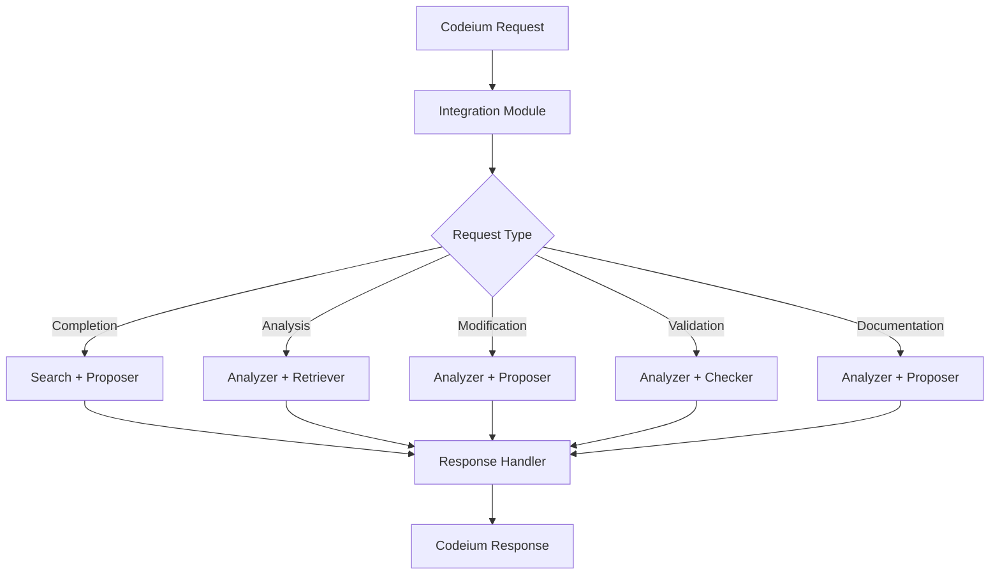

# Knowledge Graph Tools

This directory contains tools for code analysis, visualization, and maintenance using a knowledge graph approach.

## Components

### Knowledge Graph Core
- `graph_db.py`: Graph database manager using SQLite
- `graph_updater.py`: Automated graph updates with validation
- `ts_analyzer.py`: TypeScript file analysis

### Code Health Analysis
- `cleanup/code_health_manager.py`: Unified interface for analyzing and improving code health
- Features:
  - Code duplication detection using semantic similarity
  - Interface drift analysis
  - Orphaned component detection
  - Structural complexity analysis
  - Health score calculation (0-100)
  - Detailed recommendations for improvements

The code health manager uses SentenceTransformer models to perform semantic analysis of code components, detecting:
- Similar code that might need refactoring
- Implementations that have drifted from their interfaces
- Components that lack proper integration with the codebase
- Structural issues like circular dependencies

To run a health analysis:
```bash
python -m tools.kg.cleanup.code_health_manager
```

This will generate a JSON report with:
- Overall health score
- Detailed list of issues found
- Metrics for different aspects (duplication, orphans, divergence)
- Specific recommendations for improvement

### LangGraph Agents

The system uses a network of specialized agents for code analysis and modification:

#### 1. Code Analyzer Agent (`agents/code_analyzer.py`)
- Analyzes code structure and patterns
- Detects common design patterns
- Performs security analysis
- Evaluates performance implications
- Calculates code metrics

Features:
- Pattern detection (Singleton, Factory, Observer)
- Security vulnerability scanning
- Performance bottleneck detection
- Complexity analysis

#### 2. Context Retriever Agent (`agents/context_retriever.py`)
- Semantic code search
- Documentation retrieval
- Relationship analysis
- Usage pattern detection

Features:
- Multi-modal search (code, docs, tests)
- Smart context ranking
- Graph-based relationship traversal
- Relevance scoring system

#### 3. Dependency Validator Agent (`agents/dependency_validator.py`)
- Validates code changes
- Prevents breaking changes
- Analyzes impact
- Suggests improvements

Features:
- Signature validation
- Dependency analysis
- Circular dependency detection
- Impact scoring
- Suggestion generation

### Configuration

#### Agent Network (`langgraph/agent_config.py`)
- Agent type definitions
- Workflow configurations
- Message type specifications
- Network state management

#### Base Agent (`langgraph/base_agent.py`)
- Common agent functionality
- State management
- Error handling
- Validation framework

## Workflows

1. **Code Analysis**:
   ```
   Analyzer -> Retriever -> Validator
   ```

2. **Code Modification**:
   ```
   Analyzer -> Retriever -> Proposer -> Validator -> Executor
   ```

3. **Impact Analysis**:
   ```
   Analyzer -> Validator
   ```

## RAG (Retrieval-Augmented Generation) System

The RAG system enhances code analysis and generation through intelligent retrieval and context-aware generation.

### Components

#### 1. Code Embeddings Manager (`rag/embeddings.py`)
- Generates and manages code embeddings using CodeBERT
- FAISS index for efficient similarity search
- SQLite metadata storage
- Incremental updates and deletions

#### 2. Code Retriever (`rag/retriever.py`)
- Intelligent code chunk retrieval
- Multi-factor ranking:
  - Semantic similarity
  - Recency
  - Symbol overlap
  - Context relevance
- Advanced filtering capabilities
- Context-aware reranking

#### 3. Code Generator (`rag/generator.py`)
- Template-based code generation
- Example-guided generation
- Post-processing and formatting
- Explanation generation
- Confidence scoring
- Constraint validation

#### 4. Semantic Search Optimizer (`rag/semantic_search.py`)
- Enhanced search quality through:
  - Query understanding and enhancement
  - Intent-based matching
  - Context-aware ranking
  - Multi-factor scoring
- Codeium Integration:
  - Query enhancement using Codeium context
  - Confidence-based result ranking
  - Adaptive scoring based on completion context
  - Fallback mechanisms for robustness

### Integration with Codeium

The semantic search system is designed to work seamlessly with Codeium:

1. **Query Enhancement**
   - Utilizes Codeium's completion context
   - Extracts relevant symbols and patterns
   - Incorporates file-level context
   - Adapts to different query intents

2. **Result Ranking**
   - Combines multiple relevance factors:
     - Semantic similarity
     - Intent matching
     - Context relevance
     - Codeium confidence
   - Adaptive scoring based on query source

3. **Context Awareness**
   - Uses surrounding code context
   - Considers cursor position
   - Incorporates file imports and dependencies
   - Adapts to different languages

4. **Optimization Rules**
   - Language-specific keywords
   - Intent-based modifiers
   - Configurable scoring weights
   - Extensible rule system

### Usage

1. Basic Search:
   ```python
   from tools.kg.rag.semantic_search import SemanticSearchOptimizer, QueryContext, QuerySource, QueryIntent

   # Initialize optimizer
   optimizer = SemanticSearchOptimizer(embeddings_manager, retriever)

   # Create search context
   context = QueryContext(
       source=QuerySource.CODEIUM,
       intent=QueryIntent.COMPLETION,
       language="python",
       file_path="path/to/file.py",
       cursor_position=100,
       surrounding_code="def example():"
   )

   # Perform search
   results = await optimizer.optimize_search("implement sorting algorithm", context)
   ```

2. With Codeium Context:
   ```python
   # Include Codeium context
   context = QueryContext(
       source=QuerySource.CODEIUM,
       intent=QueryIntent.COMPLETION,
       language="python",
       file_path="path/to/file.py",
       codeium_context={
           "completion": {
               "prefix": "def sort_",
               "suffix": "return sorted_list"
           },
           "file": {
               "imports": ["from typing import List"],
               "classes": ["Sorter"],
               "functions": ["sort_array"]
           }
       }
   )

   # Search will incorporate Codeium context
   results = await optimizer.optimize_search("implement quicksort", context)
   ```

## Codeium Integration

The system integrates deeply with Codeium through multiple components:

### 1. Integration Module (`codeium/integration.py`)
Provides a unified interface for all Codeium interactions:
- Request handling and routing
- Response formatting
- Error handling and recovery
- Configuration management

### 2. Request Types
Handles various Codeium request types:
- **Completion**: Code completion with context
- **Analysis**: Code analysis and insights
- **Modification**: Code changes and refactoring
- **Validation**: Code quality and consistency checks
- **Documentation**: Documentation generation and updates

### 3. Agent Integration
Coordinates between Codeium and LangGraph agents:
- **Code Analyzer**: Analyzes code structure and patterns
- **Change Proposer**: Generates and validates code changes
- **Context Retriever**: Finds relevant code context
- **Consistency Checker**: Ensures code quality

### 4. Workflow Integration


### Usage

```python
from tools.kg.codeium.integration import CodeiumIntegration, CodeiumRequest, CodeiumRequestType

# Initialize integration
integration = CodeiumIntegration(
    analyzer=analyzer,
    proposer=proposer,
    retriever=retriever,
    checker=checker,
    search_optimizer=search_optimizer
)

# Process request
request = CodeiumRequest(
    type=CodeiumRequestType.COMPLETION,
    content="implement quicksort",
    file_path="path/to/file.py",
    cursor_position=100,
    language="python",
    context={
        "surrounding_code": "def sort_array(arr):",
        "imports": ["from typing import List"]
    }
)

response = await integration.process_request(request)
```

### Configuration
The integration can be configured through:
- `codeium_config.json`:
```json
{
    "confidence_threshold": 0.7,
    "max_changes_per_request": 10,
    "validation_strictness": "moderate",
    "documentation_style": "google"
}
```

## Configuration

The system can be configured through:
- `optimization_rules.json`: Defines search optimization rules
- `templates.json`: Contains code generation templates
- Environment variables for model selection and caching

### Dependencies
- `transformers`: For CodeBERT model
- `faiss-cpu`: For similarity search
- `torch`: For model inference
- `sqlite3`: For metadata storage
- `httpx`: For async HTTP requests

## Usage

1. Start the knowledge graph system:
   ```bash
   python tools/start_knowledge_graph.py
   ```

2. Access the visualization dashboard:
   ```
   http://localhost:8501
   ```

## Features

### Implemented
- Knowledge graph generation
- TypeScript analysis
- Code structure visualization
- Dead code detection
- Duplicate identification
- Automated updates
- Security validation
- Performance analysis
- Circular dependency detection
- Impact scoring
- Backup/rollback system
- LangGraph integration
- Agent workflow system
- Semantic search
- RAG system
- Semantic search optimization
- Code Duplication Detection
- Orphaned Component Detection
- Divergence Analysis
- Overall Health Metrics

### In Progress
- Change Proposer agent
- Consistency Checker

## Dependencies
See `requirements.txt` for full list of dependencies.

## Semantic Context Manager

### Health Analysis Features

The semantic context manager now includes advanced health analysis capabilities:

1. **Code Duplication Detection**
   - Finds semantically similar code sections
   - Uses configurable similarity thresholds
   - Groups related duplicates together

2. **Orphaned Component Detection**
   - Identifies code with no semantic relationships
   - Uses relaxed thresholds to avoid false positives
   - Suggests integration opportunities

3. **Divergence Analysis**
   - Tracks components that drift from original purpose
   - Measures relationship changes over time
   - Calculates divergence scores

4. **Overall Health Metrics**
   - Composite health score (0-1)
   - Component relationship statistics
   - Detailed recommendations

### Health Report Generator

Generates detailed health reports for the codebase:

```bash
python generate_health_report.py <output_path>
```

The report includes:
- Overall health score
- Key metrics (duplication, orphans, divergence)
- Detailed issue analysis
- Actionable recommendations

### Usage

1. Initialize the semantic context:
```python
from kg.semantic_context_manager import SemanticContextManager

context_manager = SemanticContextManager(Path("./semantic_context"))
```

2. Analyze codebase health:
```python
health_data = context_manager.analyze_codebase_health()
```

3. Find specific issues:
```python
# Find code duplicates
duplicates = context_manager.find_duplicates(threshold=0.9)

# Find orphaned components
orphans = context_manager.find_orphaned_components()

# Find divergent components
divergent = context_manager.find_divergent_components()
```

### Configuration

The tools can be configured through:
- Similarity thresholds
- Analysis depth
- Update frequency
- Cache settings

See individual tool documentation for specific configuration options.

### Dependencies

Required packages:
- lightrag-hku>=0.1.0
- sentence-transformers>=2.2.2
- neo4j-python-driver
- watchdog

## Recent Changes

2025-02-24:
- Added advanced health analysis features
- Enhanced semantic relationship tracking
- Improved memory enforcement
- Added detailed health reporting
